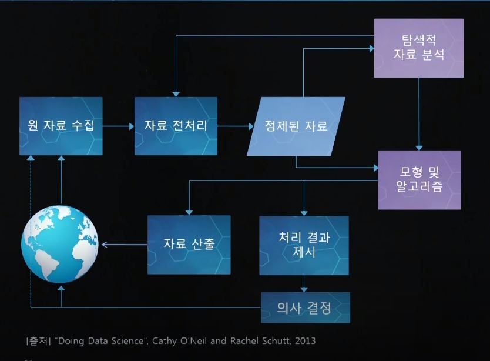
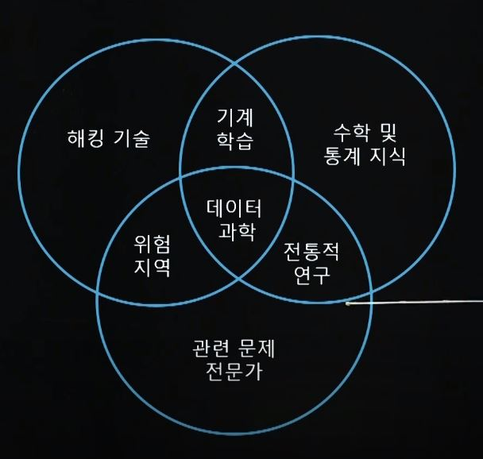

# 2019.12.10. (화)

| 학습형태    | [x] 개별 [] 2인 1조 [] 팀별                                  |
| ----------- | ------------------------------------------------------------ |
| 구성원      | 이지훈                                                       |
| 일정        | 09:00 ~ 13:00                                                |
| 데일리 목표 | 2 - 1 / 데이터 생성 / 활용 사례 2 - 2 / 데이터의 산업체 활용 및 변화 2 - 3 / 데이터의 현재 모습과 활용도 변화 2 - 4 / 데이터 이용하기 (용도, 분석 절차, 역할) 2 - 5 / 빅데이터 활용 사례 Quiz |

### 2 - 1 / 데이터 생성/활용 사례

- 여행의 경우 정보화 이전과 현재에 변화가 생김
  - 예측 불가능, 정해진 방향 vs 예측 가능, 실시간 변화
- 교육의 경우 전통적 방법과 미래 지향적 방법에 차이가 있음
  - 개개인의 특성에 맞춘 지도와 평가가 가능

### 2 - 2 / 데이터의 산업체 활용 및 변화

- 자료 접근성 제한
  - 의료 서비스업 (의료 장비, 제약 등)
    - 자료 제한성과 비구조화 (고객에게 직접적인 데이터 확보 힘듬)
  - 산업 장비 / 중간재 제조업
    - 최종 상품 관련 자료 접근성 결여
  - B2B 회사
    - 고객 자료 접근성 결여
- 자료 활용도 부족
  - 전통적 예대업 위주 은행
    - 맞춤형 서비스 미흡
  - 통신사
    - 고객 성형 / 사회망 분석 결여 (새로운 사업 모델 개발에 미흡)
  - 언론 / 콘텐츠 서비스업 (넷플릭스, 아마존 -- 좋은 예)
    - 고객 선호도 분석, 추천 시스템 미흡
  - 소매업 (월마트 등)
    - 영업 자료 체계적 분석 미흡
  - 전력회사
    - 전력 공급 최적화 결여, 스마트 그리드 지향
- 자료 활용도 활발
  - 소비재 제조업
    - 제조 공정 및 공급 최적화 (고객에게 직접적으로 데이터 수집 가능)
  - 금융 / 보험업
    - 고객 만족도 제고, 위험관리, 금융사기 탐지
  - 온라인 서비스업
    - 스마트 가로등, 보안업(Recorded Future), 시장조사(Quid, Signals Intelligence)
  - 여행 / 운송업
    - 서비스 비용 절감
  - 신용 카드사
    - 고객 관리, 위험 조기 탐지
  - 인력 관리
    - 인력 활용 최적화
- 데이터, 지식 정보 산업이 발달, 확대 될수록 일자리 변화가 커짐
- 돌아보기
  - 현재는 초 연결시대이다. 모든 사람이 데이터의 생산자이고 소비자이다.
  - 각종 산업활동에서 기업 이익과 서비스 질 향상에 데이터 분석 기술이 필수 요소다.
  - 지식과 정보 산업을 포함해서 데이터 처리 기반 산업들은 자동화가 가속화 될 것이다.

### 2 - 3 / 데이터 현재 모습과 활용도의 변화

1. #### 데이터의 현재 모습

   - 인터넷상의 데이터 생성량
     - 전 세계 데이터의 90%가 최근 2년동안 생성
     - 디지털 데이터 양이 2010년부터 2년마다 최소 2배씩 증가
     - 기계에 의한 데이터 생성량은 전통적 산업 데이터보다 50배 빠르게 성장
   - 1일 데이터 처리 용량 (2014년 기준)
     - ebay : 100PB - 영화 1억편 분량, 417만명이 24시간 동안 보는 분량
     - facebook : 600TB
     - baidu : 10 ~ 100PB
     - google : 100PB
     - Twitter : 100TB - 300쪽 책 3850만권 / 800km 높이
     - NSA : 29PB
   - 1일 인터넷 발생건수 (2017)
     - 인터넷 문서 : 220 억건
     - 구글탐색 : 52억건
     - 페이스북 전송 : 43억건
   - 스마트폰 생성 데이터
     - 생성 데이터 크기
       - 2EB (2014년 초), 8EB (2017년 초)
     - 1일 전송문 건수
   - IoT 생성 데이터
     - 1일 생성 데이터 크기
       - 2.5EB
         - 스마트폰, smart TV, 차, 비행기, 로봇 등
     - Geared Turbo Fan(GTF) 엔진 장책 센서 개수와 초당 데이터 크기
       - 5000개 / 10GB
   - 데이터 활용도 변화
     - 자료 형태
       - 문서 파일, 영상 필름 > 컴퓨터 파일
     - 자료 생성
       - 사람 > 사람, 기계
     - 자료 활용
       - 기획 분석, 참고 자료 > 기획 분석, 참고 자료, 기계 학습
     - 자료 크기
       - 통제 가능 > 통제 불가능
     - 자료 구조
       - 구조화 > 비구조화
     - 자료 가치
       - 한시적 > 가변적
     - 자료 수집 / 생성 시간
       - 사전 결정 가능 > 개방적
     - 자료 분석
       - 전통적 분석 > 전처리 기술 필요, 전통적 분석, 실시간 분석
   - 데이터와 정보
     - 데이터 (수집된 집합체) -- 추출 --> 정보 (추출물)
       - 소수에 의해 생성된 데이터의 확대 재생산 여부 확인 필요
       - 데이터 크기와 정보량은 항상 정비례 관계는 아님
       - 기업은 데이터에서 사업정보 발굴 기대
   - 빅데이터 특징
     - 5V's
       - Volume (크기) : 데이터 양의 크기
       - Velocity (속도) : 데이터 생성 속도
       - Variety (다양성) : 데이터 구성요소의 다양성 (문자, 그림, 영상 등)
       - Variability (변동성) : 데이터 내용의 일관성 여부 (체계적이지 않은 경우가 많음)
       - Veracity (정확성) : 데이터의 정보 함유 정도
   - 돌아보기
     - 데이터 생성 속도는 인간의 분석 역량을 추월했다고 볼 수 있다. 데이터 처리 자동화는 필연적 상황이다.
     - 데이터 처리 자동화는 실시간 서비스 역량 강화를 가능케 한다.
     - 빅데이터는 형식, 구성요소, 내용 등의 다양성과 축적 속도 면에서 고도의 전처리 기술을 필요로 한다.

### 2 - 4 / 데이터 이용하기 (용도, 분석 절차, 역할)

2. #### 데이터 이용하기

   - 데이터 용도 변화
     
     - 실험실, 연구실 (Small data) > 산업 현장 (Big data)
   - 데이터 과학 절차
     
     - 
   - 데이터과학 벤다이어그램 (Drew Conway 제시)
     
     - 
   - 산업 현장에서의 데이터 과학
     - 대학
       
       - 데이터에서 필요한 정보를 추출하고 해석하는 방법을 연구
     - 산업
       - 책임 범위에 따라 역할 차이
         - 최고위직
           - 회사의 데이터 전략 (내용과 사용 목적) 수립
           - 데이터 처리팀 구성
           - 기업 내 리더들과의 소통 (70 ~ 80%의 지식정보사업이 소통 부족으로 실패)
         - 실무 책임자
           - 데이터 수집부터 정보 추출 및 해석 담당
           - 데이터 수집 및 처리를 위한 새로운 알고리즘 개발
           
           

### 2 - 5 / 빅데이터 활용 사례

- 사례
  - Kaplan
    - 학생 개별 학습 안내 서비스 제공
  - Macy 백화점
    - 상품 가격 최적화 시간을 일 단위에서 분, 초 단위로 단축
    - 7300만 품목의 가격 최적화 시간을 27시간에서 1시간대로 단축
  - Netflix
    - 영화 추천시스템 개발 및 영화 선호 추세 예측
  - United Healthcare 보험사
    - 고객만족도 개선, 시장 대응에서 시장 선도로
  - 항공사와 호텔
    - 좌석이나 방, 시간대별 가격 최적화
  - Norvatis
    - 유전자 정보 분석으로 질병과 암 예방 및 처방 기술 연구
  - UPS 서비스
    - 운송로 최적화로 3200만 리터의 연료 절약 (2011)
    - 물건 상태 관리
  - 제조 공정 개선
    - 제조 장치들의 통신망 구축
    - 네덜란드 코카콜라 공장의 시스템 고장 발생률 15%정도 감소
  - Verizon Wireless
    - 고객 동향 정보 분석
    - 미국 NBA 농구팀, Phoenixx Suns, 관중 정보 사례
      - 출신지역, 연령, 수입, 자녀, 참관여부, 식당이용률
  - 돌아보기
    - 데이터 이용은
      - 문제 설정 > 데이터 수집 > 데이터 분석 > 결과 활용
      - 으로 구성된다
    - 데이터 이용은 새로운 데이터 생성을 유발
    - 산업 활동에서의 **데이터 이용 효율은 부서간 원활한 소통을 전제**로 한다.
