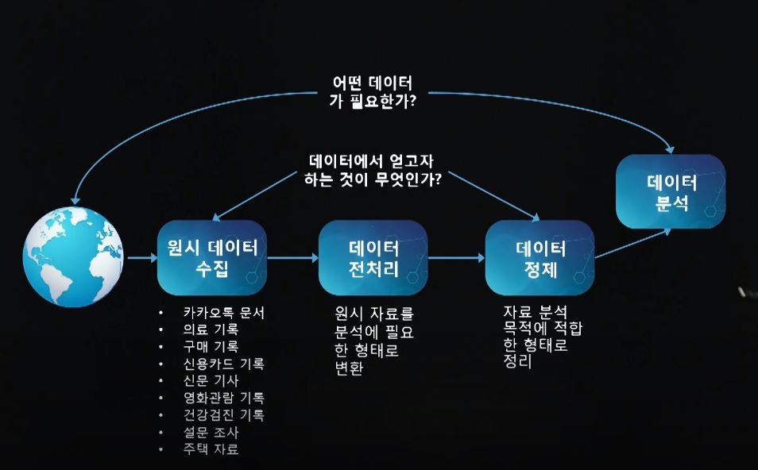
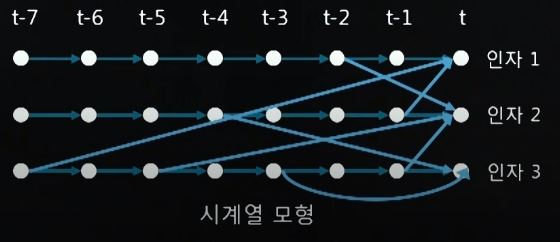
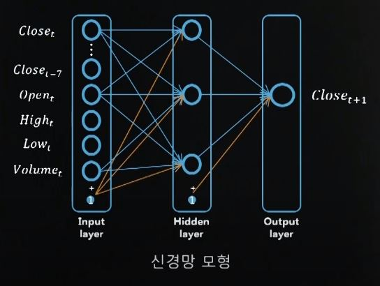
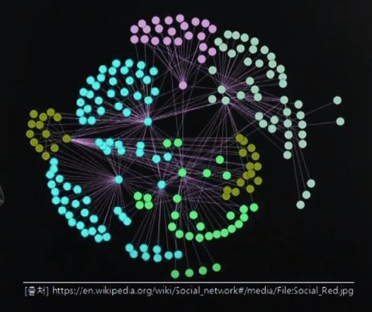
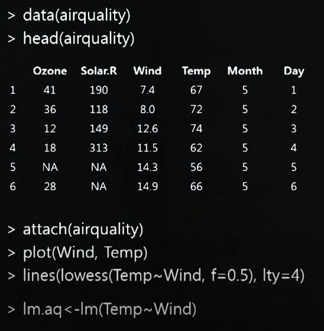
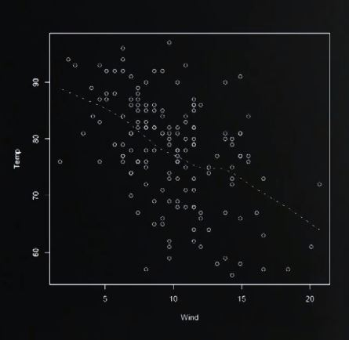
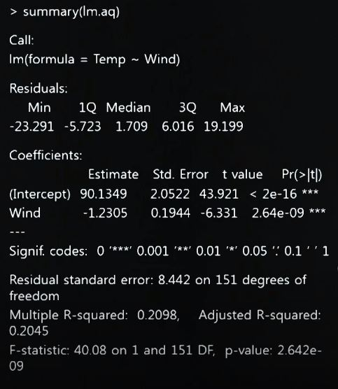
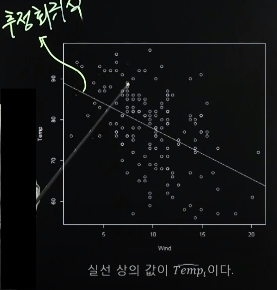
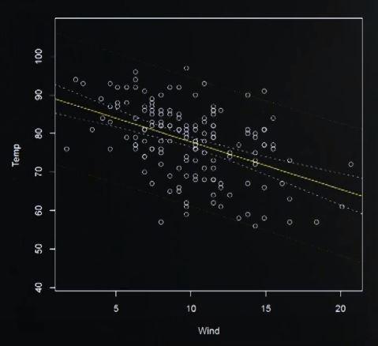
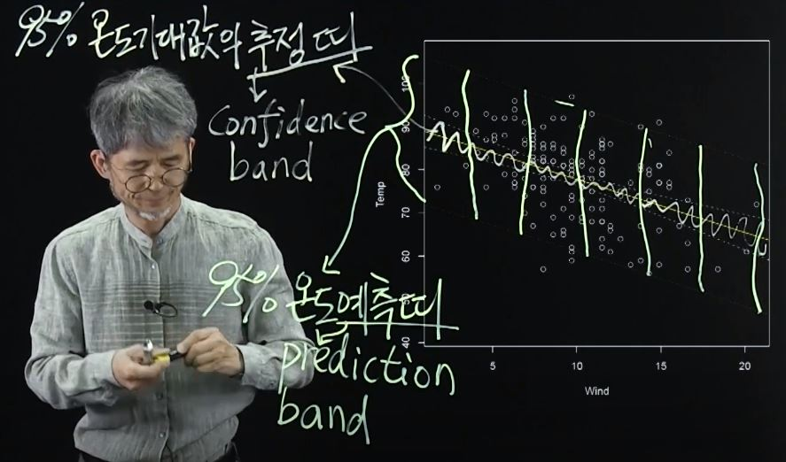

# 2019.12.11. (수)

| 학습형태    | [x] 개별 [] 2인 1조 [] 팀별                                  |
| ----------- | ------------------------------------------------------------ |
| 구성원      | 이지훈                                                       |
| 일정        | 09:00 ~ 13:00                                                |
| 데일리 목표 | 3 - 1 / 데이터 분석 개요 3 - 2 / 분석 기술의 종류 3 - 3 / 데이터 분석의 승패 3 - 4 / 회귀 분석 Quiz |

### 3 - 1 / 데이터 분석 개요

- 빅데이터 분석 기술
  - 기계학습
    - 신경망 모형 개발의 명암 : 신속성과 해석력
  - 전통적 방법
    - 통계적 모형 개발의 명암 : 제한성과 해석력
  - 자료 다양성
    - 자연언어 처리, text-mining, 비디오 및 영상 분석
  - 사람과 기계의 연결 (가장 효율적)
    - 기계의 속도 및 정밀성과 사람의 논리 및 직관력
- 데이터 처리 과정
  - 

### 3 - 2 / 분석 기술의 종류 (중요! 다시 보기!)

- 회귀분석 (입, 출력 자료가 존재)
  - 선형회귀 
    - 수학적
  - 비선형 회귀 
    - 수학적
  - 로지스틱 
    - 수학적, 비선형과 비슷
  - 비모수적 (휴리스틱, 수학적x, 함수 사용x)
    - 나무회귀모형
    - K-최근접이웃(K-NN)방법
    - 신경망 모형
- 군집 모형
  - 위계적 군집 분석 
    - 소집단간 거리가 점점더 명확해 지는 것을 점차적으로 분류
  - 비위계적 군집 분석 
    - K - 평균 방법 
      - 전체 집단을 임의의 k개의 소집단으로 나누어 각 소집단의 균일화로 분류
- 분류 분석 (가장 많이 쓰이는 분석법)
  - **Naive Bayes** 방법 
    - 가정의 출현이 서로간에 독립관계로 가정 후 분류
    - 분류할 때 Bayes이론에 기반
  - K-최근접이웃(NN) 방법 
    - 직관적, 아이디어가 간단함
    - 적용범위가 넓음
  - Support Vector Machine 방법 
    - 데이터 친화적, 활용도 높음
- **시자료 분석** (금융시장에서의 환율, 주식, 뇌 신경 간 정보 전달 역학 관계 등, 굉장히 많이 나타남)
  - 시계열 모형 (Time Series)
    - 
    - 여러 인자 간 관계 구조 파악에 용이
  - 신경망 모형
    - 
    - 하나의 인자에 대한 분석에 용이
    - Deep Learning
- 인과성 분석 (causation, 현재 학계에서 뜨거운 감자)
  - 요인들 사이의 원인, 결과 관계 파악
  - 요인이 많아 질수록 관계 분석이 까다로움
- Social Network 분석 
  - 
  - 대중적 관심이 큼
  - 인과성 분석과는 조금 다름
  - 연결성 (betweenness) : 관계성의 강도 표시x, 연결 유무만 표시함
  - 중심성 (centrality) : 허브를 지님
  - 군집특성

### 3 - 3 / 데이터 분석의 승패

- 자료의 대표성
  - 분석 대상이 명확하고 랜덤성이 있어야함
- 자료 크기
  - 충분히 커야함
- 가정 설정
  - 확률적, 수학적 모형을 가정해도 괜찮을지
- 평가함수 선택
  - 평가함수에 따라 데이터 의존적 성격을 띌 수 있음
- 수치적 오류
  - 데이터, 계산상의 수치적 오류
  - 복잡한 모형에서의 수치적 오류
- 확률적 해석 오류
  - 확률적, 통계적인 지식 부족으로 인한 오류

### 3 - 4 / 회귀 분석

- 모형(model) -- 추정 회귀선
  - `Temp = a + b * Wind + Noise`
- 목적
  - 자료를 잘 설명해주는 모형 찾기
- 자료
  - `(Wind.i, Temp.i), i = 1, 2, ... , n`
- 원리
  - 아래 Q값을 최소화하는 model의 a, b값을 구함
  - `Q = Sigma(i = 1, n)(Temp.i(real) - Temp.i(model))^2`

- 
  - data : R에서 해당 data를 불러옴
  - head : 표로 나타냄
  - attach : 특정 table을 사용
  - plot : 그래프를 그림
  - line : 선의 폭(f)과 타입(ty)를 설정
  - lm : 선형 모델화
  - 결과 그래프
    - 

- 
  - 
  - 각각의 작은 원이 Residuals
  - intercept == a, Wind == b
  - pr값이 0.05보다 작으면 data가 유의미하다
  - Residual standard error : 잡음의 표준편차
  - Multiple R-Squared
    - 전체 온도 값들의 변이가 추정회귀식으로 설명되는 부분
    - 값이 작을수록 Residual이 선으로 부터 멀리 떨어져있음
- 활용 : 추론과 예측
  - 
  - 안쪽 점선 띠는 온도 기대값의 추정 영역
  - 바깥쪽 점선 띠는 미래 특정 일의 온도 예측 영역
  - 
