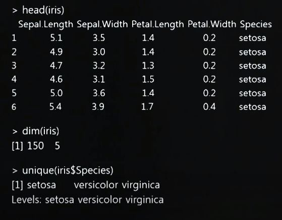
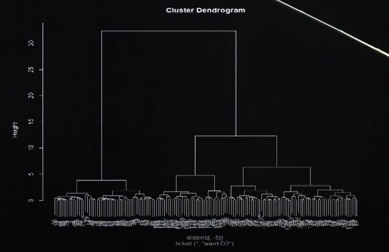
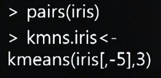
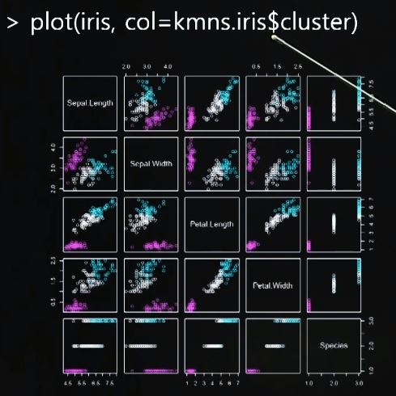
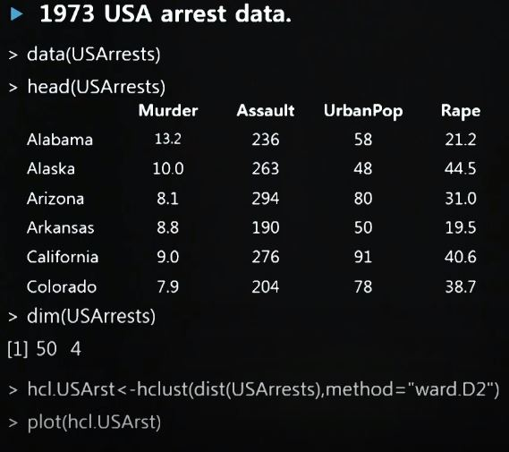
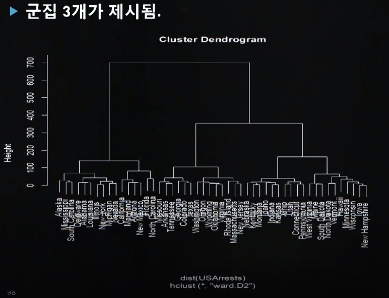
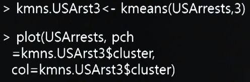
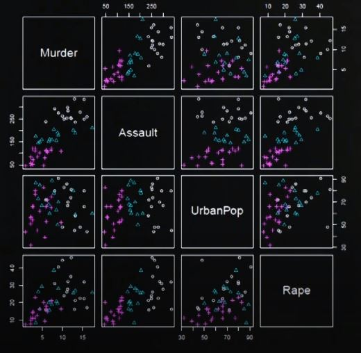
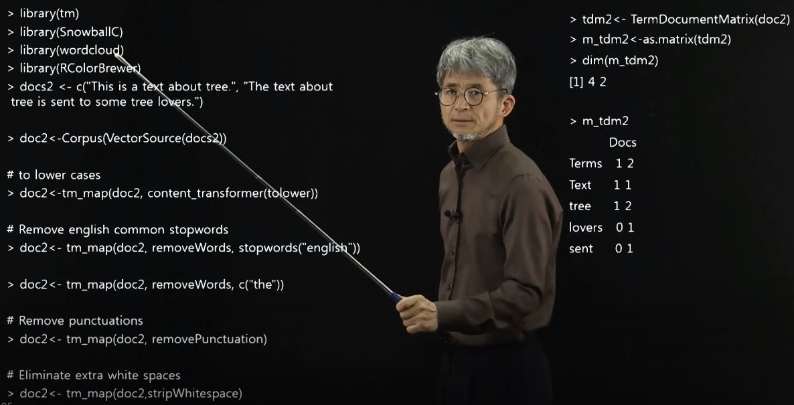
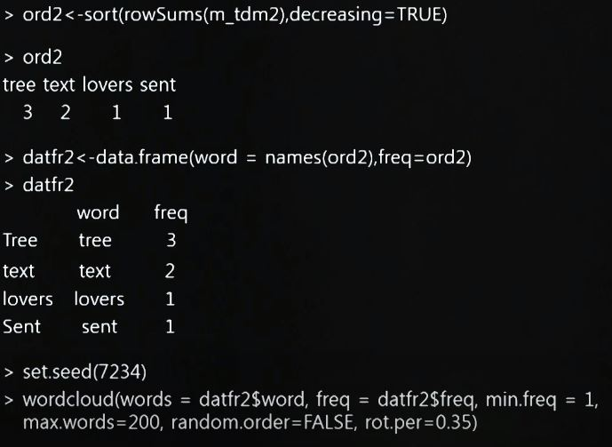

# 2019.12.12. (목)

| 학습형태    | [x] 개별 [] 2인 1조 [] 팀별                                  |
| ----------- | ------------------------------------------------------------ |
| 구성원      | 이지훈                                                       |
| 일정        | 09:00 ~ 13:00                                                |
| 데일리 목표 | 4 - 1 / 군집 분석 정의 및 사례 1 4 - 2 / 군집 분석 사례 2 4 - 3 / 단어 구름 분석 정의 밑 사례 1 4 - 4 / 단어 구름 사례 2 Quiz |

### 4 - 1 / 군집 분석 정의 및 사례

- 위계적 군집 분석

  - 

  - head : 데이터를 불러옴

  - dim : 차원수, 요소수

  - Ward 위계 군집화

    - 군집 내 오차 제곱합이 최소가 되도록 진행
    - i 번째 군집의 오차 제곱합
      - ESS.i = sigma(j = 1, n.i)(x.j^i - x^(-i))' * (x.j^i - x^(-i))
    - 군집이 k개 일 때, 전체 오차제곱합
      - ESS = sigma(i = 1, k)ESS.i
    - 자료 전체가 하나의 군집으로 될 때까지 진행
    - 
      - 제일 높은 부분이 ESS

    - 장점
      - 군집화 과정을 한 눈에 볼 수 있음
      - 전체 군집을 몇개의 소집단으로 나눌지 예상할 수 있음

- 비위계적 군집분석

  - K - 평균 방법
    - K개 군집을 자료 공간에 잡는다
    - 각 자료 점을 군집 평균값이 가장 작은 최근접 군집으로 포함 시키고 군집 평균값으로 조정
    - 모든 자료점에 대해서 각각 최근접 군집 평균값 포함 시킨 후 해당 군집 평균값 조정
    - 더 이상 자료점의 군집 소속 변경이 없을때 까지 위의 3을 반복
    - 
    - 
      - (3, 2), (2, 3)의 같은 경우가 분류가 잘됨

### 4 - 2 / 군집분석 사례

- 위계적 군집분석
  - 
  - 
- 비위계 군집분석
  - K - 평균 방법
    - 
    - 

### 4 - 3 / 단어구름 분석 정의 및 사례 - 1

- 
- 
