# 2019.12.13. (금)

| 학습형태    | [x] 개별 [] 2인 1조 [] 팀별                                  |
| ----------- | ------------------------------------------------------------ |
| 구성원      | 이지훈                                                       |
| 일정        | 09:00 ~ 13:00                                                |
| 데일리 목표 | 데이터 과학 산책<br /> - 5 - 1 / 신경망 모형<br /> - 5 - 2 / 데이터 분석에 대한 전체적인 정리<br /> - 5 - 3 / 데이터 과학은 종합 과학<br /> - 5 - 4 / 종합 학문으로서의 데이터<br /> - Quiz<br />데이터 사이언스 기초<br /> - Chapter 1. Introduction and Optimization Problems<br />알고리즘 문제풀이 |

## 데이터 과학 산책

### 5 - 1 / 신경망 모형

- 뇌 신경망의 생각 전달과정을 기계적으로 모방
- 신경망 모형 구조
  - 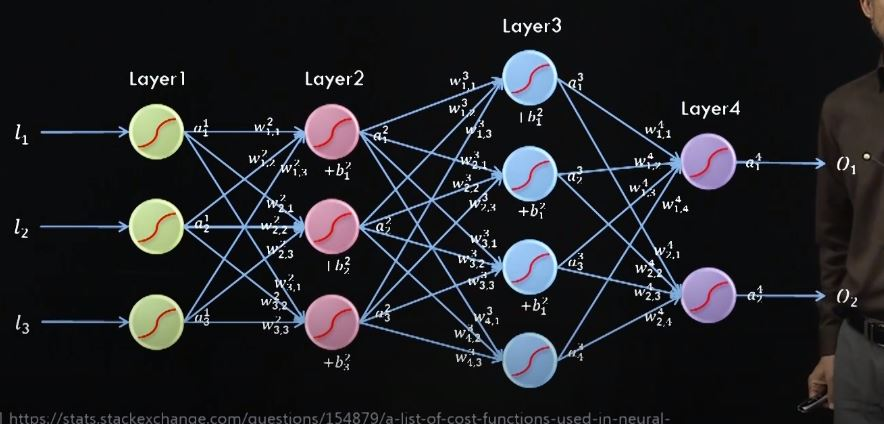
- 신경망 각 노드에서의 함수 값 계산
  - 출력층(output layer)에서 k번째 층
    - 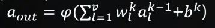
  - j번째 내부(hidden)층에서
    - 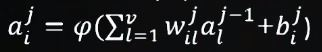
  - 여기서 p는 아래와 같은 꼴을 주로 많이 사용한다.
    - 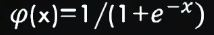
    - 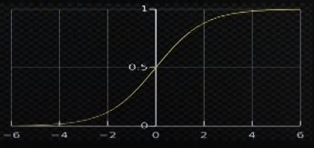
    - 아래, 위로 제한이 있는 단조 증가 함수 (로지스틱)
- 신경망 모형 R 데이터
  - 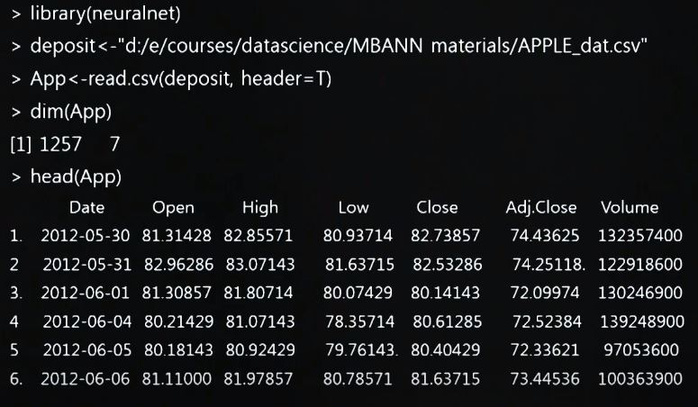
    - 다음날 주식의 종가(Close)를 예측하려함
  - 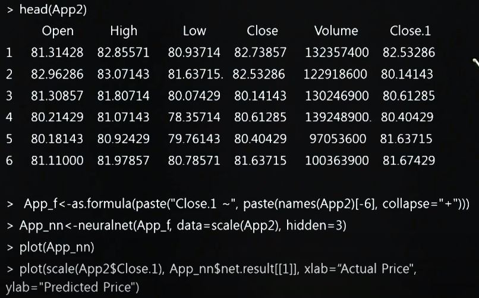
    - 다음날 주식의 종가를 추가
  - 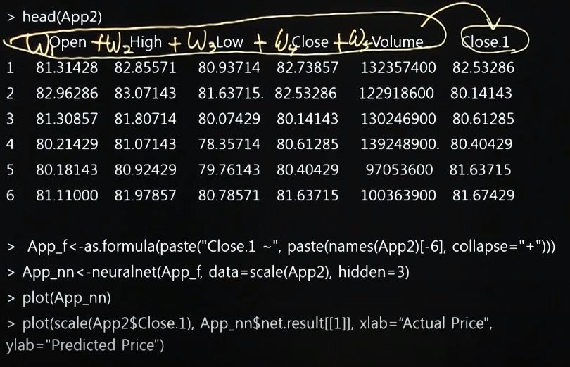
    - App_f의 연산이 위의 col을 신경망 함수로 계산하여 Close.1을 추측한다는 의미
  - 학습된 인공지능 신경망 구조
    - 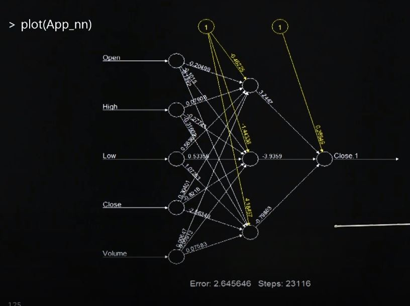
  - 인공신경망에 의한 Apple 주가 예측 성능 점검
    - (위 R code의 제일 마지막 줄)
    - 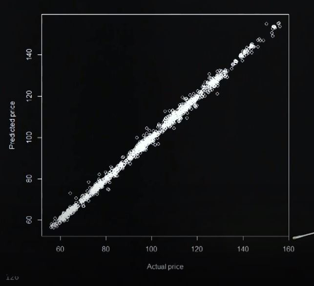
    - y축 : 예측 값 (계산된 값)
    - x축 : 실제 값


### 5 - 2 / 데이터 분석에 대한 전체적인 정리

- 돌아보기

  - 자료 분석에는 크게 **두가지 유형**이 있다. 자료 안에서 입력 부분과 출력 부분을 구분하고 분석하는 **지도학습형 분석**(ex.회귀분석)과 출력 부분 없이 분석하는 **비지도학습형 분석**이 있다.

  - 분석 목적에 따라서 동일한 자료에 대해서 다양한 분석방법이 적용된다.

  - 회귀 분석은 입력 부분과 출력 부분의 관계를 파악하는데 도움이 된다. 이 관계는 모수적 모형(수학적, 확률적)으로 선형, 비선형 모형이 있고, 비모수적 모형으로 나무구조 모형이 있다.

  - 군집분석은 자료에 포함된 개체들의 내재적 특징을 바탕으로 군집화하는 절차다. 자료 속 군집의 개수, 특징, 규모를 파악하는데 도움이 된다.

  - 단어구름 분석은 문서에 포함된 단어들을 빈도수 기준으로 크기 조정해서 모아놓은 절차이다. 분석 결과를 문서 분류에 활용할 수 있다.

  - 신경망 학습은 입력과 출력을 다중 복합함수형태로 연결시키는 분석절차다. 적용 범위가 넓고 학습이 잘 된다.

    내부층(hidden layer)이 많아지고 각 층의 노드 수가 많아 질때의 신경망 학습을 특별히 Deep Learning이라고 부른다.


### 5 - 3 / 데이터 과학은 종합 과학

-  데이터 과학은 데이터 **활용도를 극대화**하는 방법과 기술을 연구하는 분야이다.
- 데이터는 문제 설정과 수집, 정제, 분석, 결과 활용의 각 단계에서 참여자들간의 원활한 의사 소통이 성공적 데이터 활용을 위한 필수조건이다.
- 산업체의 경우
  - 문제 설정은 **기업 리더의 의사**가 중요하다.
  - 데이터 수집은 데이터 종류에 따라서 **다양한 공학적 기술**이 요구된다.
  - **데이터 정제**는 관련 알고리즘의 개발이 요구되고, **분석**은 확률 및 통계학적 이론을 기반으로 하는 방법과 기술 개발이 필요하다.
  - 결과 활용도 제고를 위해서는 기업이나 산업**현장에서 실시간으로 활용할 수 있는 기술**이 필요하다.
- 현재 생성되는 데이터는 그 크기와 다양성 면에서 인간이 다룰 수 있는 한계를 넘어섰다고 볼 수 있다.
  - 기계(센서, 자동화 등)를 통한 수집
- 따라서 실시간 분석과 데이터 처리 자동화는 자연스러운 변화다.
- 데이터과학은 **데이터라는 원료를 사용해서 고품질 제품(정보 또는 지식) 생산을 위한 방법을 연구하고 개발하는 종합 학문**이다.


### 5 - 4 / 종합 학문으로서의 데이터

- 자료 분석 또는 학습의 대분류
  - 지도학습 (supervised learning)
    - 회귀분석과 같이 데이터에 입력과 출력이 포함 된 경우
  - 비지도학습 (unsupervised learning)
    - 군집분석과 같이 데이터에 출력값이 명시되어 있지 않은 경우
- 자료분석 이론과 기법
  - 통계학 기반 전통적 이론과 방법에 대한 지식 필요
  - 데이터 전처리 기법
    - 문자, 음성, 신호, 영상 데이터의 전처리 기법
  - 실시간 데이터 처리 기법
    - 신경망 학습을 통한 기계학습방법
    - 학습 속도 개선 
      - 인공신경망 내부층이 늘어날 수록 시간이 오래걸림
      - 이를 위한 수학적, 통계학적, 컴퓨터 공학적 기술이 필요
    - 기계와 인간의 협력모형 개발 필요
      - 통계학적 이론은 기계학습이 쉬워서  인간의 목적에 맞는 알고리즘의 자동화가 필요
- 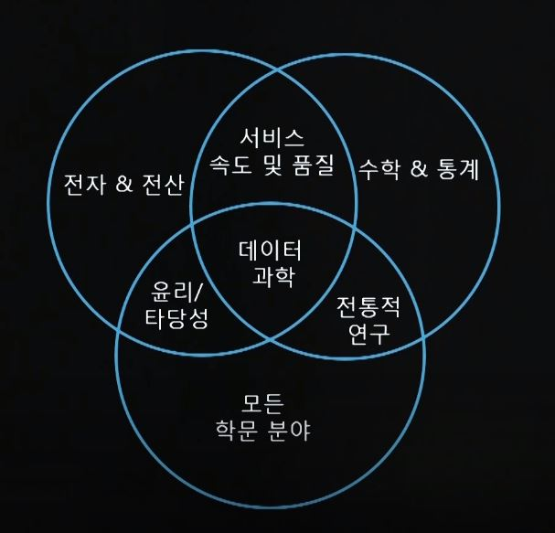


## 데이터 사이언스 기초

### Chapter 1. Introduction and Optimization Problems

- **핵심 키워드**

  - 계산 모델 (Computation Model)
  - 최적화 모델 (Optimization Model)
  - 탐욕 알고리즘 (Greedy Algorithm)

  


- **학습 내용**
  - 계산 모델
    - 이제까지 일어났던 무언가를 이해하거나 매일 보는 현상들을 설명하는 모델
    - 아직 일어나지 않은 미래를 예측할 수 있게 해주는 모델
    - ex. 날씨 변화 모델 : 천년동안 날씨가 어떻게 변했는지에 대한 모델과 미래에 어떻게 될 지 예측하는 모델을 만들 수 있음
  - 최적화 모델
    - 제한 조건을 가지며 목적 함수를 최대화 또는 최소화하는 모델
    - knapsack model
      - 제한조건 : 냅색 안에 들어갈 수 있는 양
      - 도둑이 가장 값비싼 물건을 훔쳐야 하는 최적화 문제
      - 연속 냅색 문제
        - 일부분만 가져갈 수 있는 문제 (금괴가 아닌 금모래로 가져갈 수 있는 경우)
        - 탐욕 알고리즘으로도 풀 수 있고, 풀기 쉬운편
      - 0 / 1 냅색 문제
        - 금괴를 가져가거나 아예 못 가져가는 경우
        - 한번 결정하면 그 결정이 다음 결정에 영향을 미침
    - 최적화 문제를 푸는 방법
      - 무차별 대입 알고리즘 (Brute force algorithm)
        - 모든 경우의 수를 고려해 승자를 택한 것
        - 그러나 실용적이지 않음
      - 탐욕 알고리즘 (Greedy algorithm)
        - While knapsack not full put "best" available item in knapsack
        - 여러 경우 중 하나를 결정 할 때 그 순간 best라고 생각되는 것을 선택해 나가는 방식
        - 가장 좋은 것 (best)의 의미는 정의에 따라 달라짐
        - 탐욕 알고리즘은 좋은 해를 구할 수는 있어도 최적 해를 구할 수는 없음
  - 파이썬 람다(lambda) 표현식
    - 익명의 함수를 만들 때 사용
    - (lambda 식별자 배열 : 원하는 식)
    - 이 파라미터들로 표현된 식을 계산하고 결과를 반환하는 함수를 만듬
    - def를 쓰는 대신에 인라인 함수로 정의

- Greedy algorithm

  - ```python
    class Food(object):
        def __init__(self, n, v, w):
            self.name = n
            self.value = v
            self.calories = w
        def getValue(self):
            return self.value
        def getCost(self):
            return self.calories
        def density(self):
            return self.getValue()/self.getCost()
        def __str__(self):
            return self.name + ': <' + str(self.value)\
                     + ', ' + str(self.calories) + '>'
    
    def buildMenu(names, values, calories):
        """names, values, calories lists of same length.
           name a list of strings
           values and calories lists of numbers
           returns list of Foods"""
        menu = []
        for i in range(len(values)):
            menu.append(Food(names[i], values[i],
                              calories[i]))
        return menu
    
    def greedy(items, maxCost, keyFunction):
        """Assumes items a list, maxCost >= 0,
             keyFunction maps elements of items to numbers"""
        itemsCopy = sorted(items, key = keyFunction,
                           reverse = True)
        result = []
        totalValue, totalCost = 0.0, 0.0
        for i in range(len(itemsCopy)):
            if (totalCost+itemsCopy[i].getCost()) <= maxCost:
                result.append(itemsCopy[i])
                totalCost += itemsCopy[i].getCost()
                totalValue += itemsCopy[i].getValue()
        return (result, totalValue)
    
    def testGreedy(items, constraint, keyFunction):
        taken, val = greedy(items, constraint, keyFunction)
        print('Total value of items taken =', val)
        for item in taken:
            print('   ', item)
    
    def testGreedys(foods, maxUnits):
        print('Use greedy by value to allocate', maxUnits,
              'calories')
        testGreedy(foods, maxUnits, Food.getValue)
        print('\nUse greedy by cost to allocate', maxUnits,
              'calories')
        testGreedy(foods, maxUnits,
                   lambda x: 1/Food.getCost(x))
        print('\nUse greedy by density to allocate', maxUnits,
              'calories')
        testGreedy(foods, maxUnits, Food.density)
    
    
    names = ['wine', 'beer', 'pizza', 'burger', 'fries',
             'cola', 'apple', 'donut', 'cake']
    values = [89,90,95,100,90,79,50,10]
    calories = [123,154,258,354,365,150,95,195]
    foods = buildMenu(names, values, calories)
    testGreedys(foods, 1000)
    
    ```


## 알고리즘 문제 풀이

- 경로 탐색

- ```python
  def find(y,x):
      global ans, visited
      min = 987654321
      tmp = 0
      if visited.count(1) == N:
          return ans
      for i in range(4, len(data), 2):
          dy = abs(y - data[i+1])
          dx = abs(x - data[i])
          visited(i//2) = 1
          tmp = (dy+dx)
          if min > tmp:
              min = tmp
              find(data[i+1][i])
  
  
  T = int(input())
  for tc in range(1, T+1):
      N = int(input())
      data = list(map(int, input().split()))
      visited = [0] * (N + 2)
      sx, sy = data[0], data[1]
      ex, ey = data[2], data[3]
      ans = 0
  
      print(sy, sx, ey, ex)
      print('#{} {}'.format(tc, ans))
  ```

- 