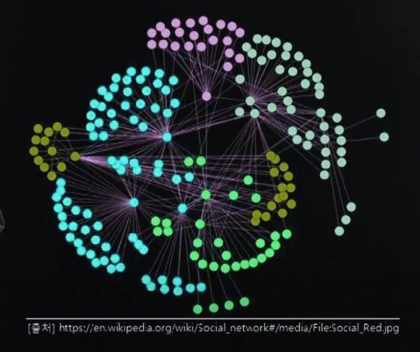
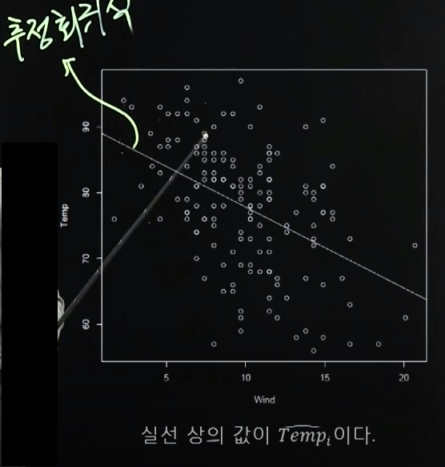
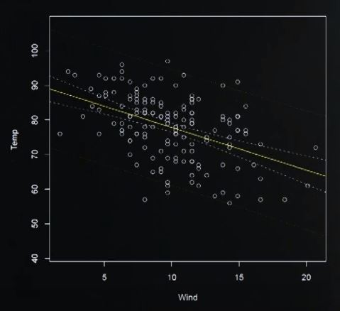
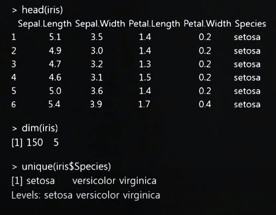
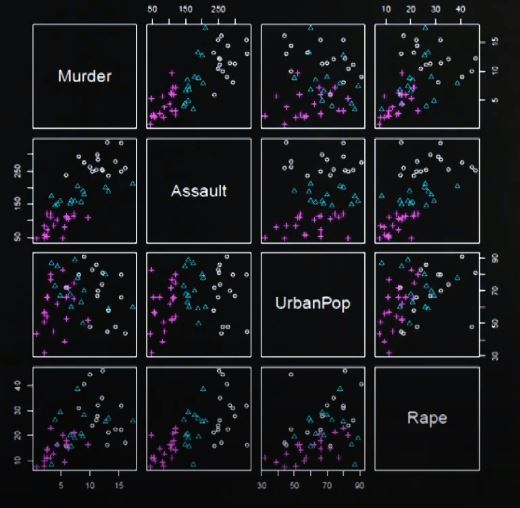
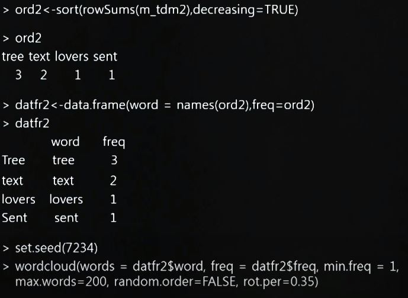
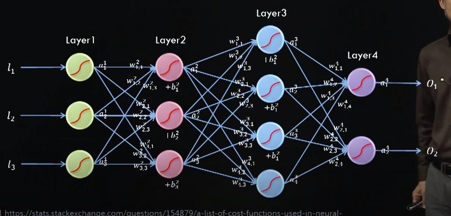
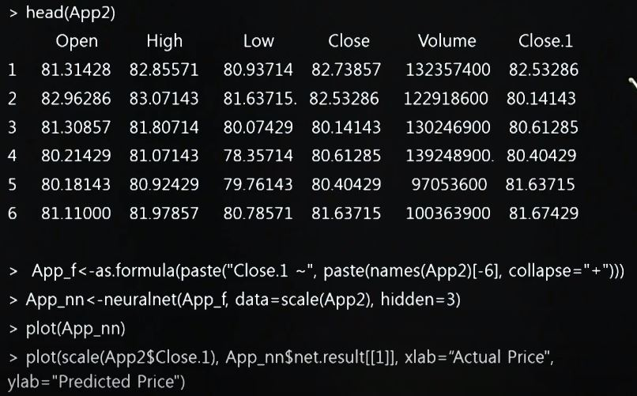

# 2019.12.09. (월)

### 1 - 3 / 데이터의 정의와 역사

- 좁은 의미
  - 관찰에 의해서 수집된 값들의 집합
  - 실험, 설문, 조사 등의 절차를 통해서 수집
  - 숫자, 문자, 그림, 음성, 영상, 전자 신호 등 다양한 형태
- 넓은 의미
  - (사람 또는 기계가) 사용 가능한 기록물
  - 기록물 생성/수집 주체가 사람 또는 기계
- 역사
  - 고대 국가에서의 인구조사 - 병력과 세수 확인 목적
  - 장영실의 측우기 - 농산물 수확량 예측 목적
  - 천체 관측 자료
  - 조선시대 토지대장
  - 다윈의 화석 자료, 영국 런던 콜레라 재앙 자료, 멘델의 완두콩 자료
  - 1800년대  통제 실험을 통한 질병 전염원 파악 자료
  - 현대
    - 건강진단 자료
    - 유전자 정보 자료 (고차원 자료, 기술발달로 인한 비용 감소)
    - 인기도 자료 (사회 관계망 분석)
    - 고객 관계 자료 (구매형태, 충성도, 요구사항)
    - 위치 추적 자료 (경기 관람객 이동)
    - IoT 자료 (유통 상품 품질, 건강 상시 측정)

### 1 - 4 / 사례별 데이터 수집 절차 및 데이터 유형

- | 사례        | 방법                         | 비고                                  |
  | ----------- | ---------------------------- | ------------------------------------- |
  | 고대 국가   | 전수 조사                    | 자료수집 / 정리                       |
  | 측우기      | 연중 조사                    | 자료수집 / 정리                       |
  | 멘델        | 기획 조사                    | 실험 목표 설정, 과학적 추론 방법 결여 |
  | 런던 콜레라 | 보고 자료                    | 자료수집 / 정리                       |
  | 질병 전염   | 보고 자료 / 기획 조사        | 원인 분석, 과학적 추론 필요성 대두    |
  | 인기도 자료 | 기획 조사 / 인터넷 검색 조사 | 과학적 추론 / 해석 가능               |
  | IoT 자료    | 자동 수집                    | 빅데이터, 기계학습, AI 필요성 대두    |

- 데이터 유형

  - 전통적 데이터
    - 숫자, 범주, 문자 데이터
  - 텍스트
    - 이메일, 카카오톡, Facebook, 신문기사
  - 기록
    - 사용자 데이터, 시간 기록 데이터, Json 형식의 로그파일
  - 지리 기반 위치 데이터
    - 주택 데이터, 이동 거리 데이터
  - 네트워크 데이터
    - 네트워크에서 발생되는 관계
  - 센서 데이터
    - 센서로 수집되는 생체, 기계, 네트워크 등 모든 데이터
  - 이미지 데이터
    - 의료, 영상 등 시각적으로 구분 가능한 데이터

- 데이터 전치리 기술의 개발이 필요

### 1 - 5 / 산업 발전 단계

- | 산업발전단계 | 시기         | 내용                                   | 비고          | 데이터 / 정보 산업                                           |
  | ------------ | ------------ | -------------------------------------- | ------------- | ------------------------------------------------------------ |
  | 1            | 18세기 말    | 증기 기관에 의한 제조 장치             | 증기 기관차   | 자료 수집 / 정리, 확률 개념 이론적 도입(Bernoulli), 확률적 역추론 이론(Bayes) |
  | 1            | 19세기       |                                        |               | 오류 확률 모형(Gauss), 선현 회귀 모형(Galton)                |
  | 2            | 20세기 초    | 전기 사용에 의한 대량 생산과 노동 분업 | 컨베이어 벨트 | 통계적 자료 분석 이론 / 방법 개발                            |
  | 3            | 1950년 대 초 | 전자와 IT사용으로 제조 자동화 발전     | 로봇 활용     | 튜링 머신(Turing), 신경망 기계 학습(Minsky & Edmonds), 근접 이웃 방법, 문서 분류 방법 |
  | 4            | 현재         | 정보 통신 기술 발달로 자동화 확대      | IoT           | 자료 크기 / 차원 거대화, 자료 구성 요소 다양화, 실시간 분석 필요성 대두, 역확산 계산(Rumelhart), Deep Blue(IBM), DeepFace(Facebook), 기계학습플랫폼(Amazon), 알파고(Google DeepMind) |

### 1 - 6 / 정보 통신 수단의 발달에 따른 데이터 SW 변화

| 년도               | 기술                         | 데이터 과학관련 SW                                           |
| ------------------ | ---------------------------- | ------------------------------------------------------------ |
| 1936               | 튜링 머신                    |                                                              |
| 1968(1991)         | 인터넷 (대중화)              |                                                              |
| 1971               | CPU칩 개발                   |                                                              |
| 1976 / 1981 / 1984 | Apple 1 / IBM PC / Macintosh | S, SAS(1976), MATLAB(1978), Mathematica(1987)                |
| 1989 (1991)        | World Wide Web (대중화)      | Python(1991), R(1993), Java(1995)                            |
| 2007               | 스마트폰                     | Deep learning(2006), GPU(2009), superhuman 시각 유형 판별 NN(2011) |
| 2016               | 사물 인터넷과 4차 산업 혁명  |                                                              |

### 1- 7 / 데이터와 4차 산업

- Siemens - Joe Kaeser 
  - 'Innovation Day 2017' : 미래에는 공장 디지털화 여부에 제조업 승패가 달렸다.
- 스마트 공장에서 IoT센서가 수집한 빅데이터를 분석해 최적화된 공정을 만들고 관리
- 빅데이터를 바탕으로 구축한 가상 공장에서 제품 설계와 생산 공정을 최적화 한 다음에 실제 공장을 구현함으로서 비용을 절감
- 실제 공장 가동 과정에서 전력 사용량, 모터 회전수와 같은 정보를 분석한 뒤 고장 발생 가능성을 예측해서 사전 예방
- 사전 예측 시스템을 활용해서 헬스케어 서비스 제공
- 데이터 의미 변화
  - 문제해결 목적 자료 수집
  - 의사 결정 보조용 ( ex. 의료 진단)
  - 데이터 분석 중에 새로운 데이터 축적 진행
  - 실시간 분석 및 의사결정
    - 상품 추천, 신용 사기행위 적발, 환자 상태 추적 등
  - 크기보다는 다양성
    - 의료 보험사가 고객 만족도 개선 목적으로 콜센터의 녹음 자료 활용
- 데이터 위상 변화
  - 의미 해석
    - 분석자 주도 > 데이터 의존적
  - 결과 활용
    - 사용자 위주 > 현장 위주
  - 형식의 변화
    - 대기 형식 > 대화 형식
    - 거시적 수준 > 미시적 수준
  - 경제적 가치
    - 후발적 용도 > 선도적 용도
      - 고객 이탈 가능성 사전 탐지
- 데이터 형식
  - 구조화된 데이터 : 분석이 용이하게 정리된 상태
  - 비구조화 데이터 : 무형적 기록 상태 
    - ex, 신문기사, 사회연결망 통신 기록, 주택관련 기록
    - 2015년 기준 전체 자료의 80%가 비구조화 형태 (IBM)
- 돌아보기
  - 데이터 수집 기술 발달과 함께 데이터의 다양성과 크기 증가
  - 산업 발달과 데이터 관련 기술 발달이 서로 상승작용을 하며 진행
  - 비구조화 데이터의 급격한 증가로 전처리 기술 개발이 많이 요구

# 2019.12.10. (화)

### 2 - 1 / 데이터 생성/활용 사례

- 여행의 경우 정보화 이전과 현재에 변화가 생김
  - 예측 불가능, 정해진 방향 vs 예측 가능, 실시간 변화
- 교육의 경우 전통적 방법과 미래 지향적 방법에 차이가 있음
  - 개개인의 특성에 맞춘 지도와 평가가 가능

### 2 - 2 / 데이터의 산업체 활용 및 변화

- 자료 접근성 제한
  - 의료 서비스업 (의료 장비, 제약 등)
    - 자료 제한성과 비구조화 (고객에게 직접적인 데이터 확보 힘듬)
  - 산업 장비 / 중간재 제조업
    - 최종 상품 관련 자료 접근성 결여
  - B2B 회사
    - 고객 자료 접근성 결여
- 자료 활용도 부족
  - 전통적 예대업 위주 은행
    - 맞춤형 서비스 미흡
  - 통신사
    - 고객 성형 / 사회망 분석 결여 (새로운 사업 모델 개발에 미흡)
  - 언론 / 콘텐츠 서비스업 (넷플릭스, 아마존 -- 좋은 예)
    - 고객 선호도 분석, 추천 시스템 미흡
  - 소매업 (월마트 등)
    - 영업 자료 체계적 분석 미흡
  - 전력회사
    - 전력 공급 최적화 결여, 스마트 그리드 지향
- 자료 활용도 활발
  - 소비재 제조업
    - 제조 공정 및 공급 최적화 (고객에게 직접적으로 데이터 수집 가능)
  - 금융 / 보험업
    - 고객 만족도 제고, 위험관리, 금융사기 탐지
  - 온라인 서비스업
    - 스마트 가로등, 보안업(Recorded Future), 시장조사(Quid, Signals Intelligence)
  - 여행 / 운송업
    - 서비스 비용 절감
  - 신용 카드사
    - 고객 관리, 위험 조기 탐지
  - 인력 관리
    - 인력 활용 최적화
- 데이터, 지식 정보 산업이 발달, 확대 될수록 일자리 변화가 커짐
- 돌아보기
  - 현재는 초 연결시대이다. 모든 사람이 데이터의 생산자이고 소비자이다.
  - 각종 산업활동에서 기업 이익과 서비스 질 향상에 데이터 분석 기술이 필수 요소다.
  - 지식과 정보 산업을 포함해서 데이터 처리 기반 산업들은 자동화가 가속화 될 것이다.

### 2 - 3 / 데이터 현재 모습과 활용도의 변화

1. #### 데이터의 현재 모습

   - 인터넷상의 데이터 생성량
     - 전 세계 데이터의 90%가 최근 2년동안 생성
     - 디지털 데이터 양이 2010년부터 2년마다 최소 2배씩 증가
     - 기계에 의한 데이터 생성량은 전통적 산업 데이터보다 50배 빠르게 성장
   - 1일 데이터 처리 용량 (2014년 기준)
     - ebay : 100PB - 영화 1억편 분량, 417만명이 24시간 동안 보는 분량
     - facebook : 600TB
     - baidu : 10 ~ 100PB
     - google : 100PB
     - Twitter : 100TB - 300쪽 책 3850만권 / 800km 높이
     - NSA : 29PB
   - 1일 인터넷 발생건수 (2017)
     - 인터넷 문서 : 220 억건
     - 구글탐색 : 52억건
     - 페이스북 전송 : 43억건
   - 스마트폰 생성 데이터
     - 생성 데이터 크기
       - 2EB (2014년 초), 8EB (2017년 초)
     - 1일 전송문 건수
   - IoT 생성 데이터
     - 1일 생성 데이터 크기
       - 2.5EB
         - 스마트폰, smart TV, 차, 비행기, 로봇 등
     - Geared Turbo Fan(GTF) 엔진 장책 센서 개수와 초당 데이터 크기
       - 5000개 / 10GB
   - 데이터 활용도 변화
     - 자료 형태
       - 문서 파일, 영상 필름 > 컴퓨터 파일
     - 자료 생성
       - 사람 > 사람, 기계
     - 자료 활용
       - 기획 분석, 참고 자료 > 기획 분석, 참고 자료, 기계 학습
     - 자료 크기
       - 통제 가능 > 통제 불가능
     - 자료 구조
       - 구조화 > 비구조화
     - 자료 가치
       - 한시적 > 가변적
     - 자료 수집 / 생성 시간
       - 사전 결정 가능 > 개방적
     - 자료 분석
       - 전통적 분석 > 전처리 기술 필요, 전통적 분석, 실시간 분석
   - 데이터와 정보
     - 데이터 (수집된 집합체) -- 추출 --> 정보 (추출물)
       - 소수에 의해 생성된 데이터의 확대 재생산 여부 확인 필요
       - 데이터 크기와 정보량은 항상 정비례 관계는 아님
       - 기업은 데이터에서 사업정보 발굴 기대
   - 빅데이터 특징
     - 5V's
       - Volume (크기) : 데이터 양의 크기
       - Velocity (속도) : 데이터 생성 속도
       - Variety (다양성) : 데이터 구성요소의 다양성 (문자, 그림, 영상 등)
       - Variability (변동성) : 데이터 내용의 일관성 여부 (체계적이지 않은 경우가 많음)
       - Veracity (정확성) : 데이터의 정보 함유 정도
   - 돌아보기
     - 데이터 생성 속도는 인간의 분석 역량을 추월했다고 볼 수 있다. 데이터 처리 자동화는 필연적 상황이다.
     - 데이터 처리 자동화는 실시간 서비스 역량 강화를 가능케 한다.
     - 빅데이터는 형식, 구성요소, 내용 등의 다양성과 축적 속도 면에서 고도의 전처리 기술을 필요로 한다.

### 2 - 4 / 데이터 이용하기 (용도, 분석 절차, 역할)

2. #### 데이터 이용하기

   - 데이터 용도 변화
     
     - 실험실, 연구실 (Small data) > 산업 현장 (Big data)
   - 데이터 과학 절차
     
     - 
   - 데이터과학 벤다이어그램 (Drew Conway 제시)
     
     - 
   - 산업 현장에서의 데이터 과학
     - 대학
       
       - 데이터에서 필요한 정보를 추출하고 해석하는 방법을 연구
     - 산업
       - 책임 범위에 따라 역할 차이
         - 최고위직
           - 회사의 데이터 전략 (내용과 사용 목적) 수립
           - 데이터 처리팀 구성
           - 기업 내 리더들과의 소통 (70 ~ 80%의 지식정보사업이 소통 부족으로 실패)
         - 실무 책임자
           - 데이터 수집부터 정보 추출 및 해석 담당
           - 데이터 수집 및 처리를 위한 새로운 알고리즘 개발
           
           

### 2 - 5 / 빅데이터 활용 사례

- 사례
  - Kaplan
    - 학생 개별 학습 안내 서비스 제공
  - Macy 백화점
    - 상품 가격 최적화 시간을 일 단위에서 분, 초 단위로 단축
    - 7300만 품목의 가격 최적화 시간을 27시간에서 1시간대로 단축
  - Netflix
    - 영화 추천시스템 개발 및 영화 선호 추세 예측
  - United Healthcare 보험사
    - 고객만족도 개선, 시장 대응에서 시장 선도로
  - 항공사와 호텔
    - 좌석이나 방, 시간대별 가격 최적화
  - Norvatis
    - 유전자 정보 분석으로 질병과 암 예방 및 처방 기술 연구
  - UPS 서비스
    - 운송로 최적화로 3200만 리터의 연료 절약 (2011)
    - 물건 상태 관리
  - 제조 공정 개선
    - 제조 장치들의 통신망 구축
    - 네덜란드 코카콜라 공장의 시스템 고장 발생률 15%정도 감소
  - Verizon Wireless
    - 고객 동향 정보 분석
    - 미국 NBA 농구팀, Phoenixx Suns, 관중 정보 사례
      - 출신지역, 연령, 수입, 자녀, 참관여부, 식당이용률
  - 돌아보기
    - 데이터 이용은
      - 문제 설정 > 데이터 수집 > 데이터 분석 > 결과 활용
      - 으로 구성된다
    - 데이터 이용은 새로운 데이터 생성을 유발
    - 산업 활동에서의 **데이터 이용 효율은 부서간 원활한 소통을 전제**로 한다.

# 2019.12.11. (수)

### 3 - 1 / 데이터 분석 개요

- 빅데이터 분석 기술
  - 기계학습
    - 신경망 모형 개발의 명암 : 신속성과 해석력
  - 전통적 방법
    - 통계적 모형 개발의 명암 : 제한성과 해석력
  - 자료 다양성
    - 자연언어 처리, text-mining, 비디오 및 영상 분석
  - 사람과 기계의 연결 (가장 효율적)
    - 기계의 속도 및 정밀성과 사람의 논리 및 직관력
- 데이터 처리 과정
  - 

### 3 - 2 / 분석 기술의 종류 (중요! 다시 보기!)

- 회귀분석 (입, 출력 자료가 존재)
  - 선형회귀 
    - 수학적
  - 비선형 회귀 
    - 수학적
  - 로지스틱 
    - 수학적, 비선형과 비슷
  - 비모수적 (휴리스틱, 수학적x, 함수 사용x)
    - 나무회귀모형
    - K-최근접이웃(K-NN)방법
    - 신경망 모형
- 군집 모형
  - 위계적 군집 분석 
    - 소집단간 거리가 점점더 명확해 지는 것을 점차적으로 분류
  - 비위계적 군집 분석 
    - K - 평균 방법 
      - 전체 집단을 임의의 k개의 소집단으로 나누어 각 소집단의 균일화로 분류
- 분류 분석 (가장 많이 쓰이는 분석법)
  - **Naive Bayes** 방법 
    - 가정의 출현이 서로간에 독립관계로 가정 후 분류
    - 분류할 때 Bayes이론에 기반
  - K-최근접이웃(NN) 방법 
    - 직관적, 아이디어가 간단함
    - 적용범위가 넓음
  - Support Vector Machine 방법 
    - 데이터 친화적, 활용도 높음
- **시자료 분석** (금융시장에서의 환율, 주식, 뇌 신경 간 정보 전달 역학 관계 등, 굉장히 많이 나타남)
  - 시계열 모형 (Time Series)
    - 
    - 여러 인자 간 관계 구조 파악에 용이
  - 신경망 모형
    - 
    - 하나의 인자에 대한 분석에 용이
    - Deep Learning
- 인과성 분석 (causation, 현재 학계에서 뜨거운 감자)
  - 요인들 사이의 원인, 결과 관계 파악
  - 요인이 많아 질수록 관계 분석이 까다로움
- Social Network 분석 
  - 
  - 대중적 관심이 큼
  - 인과성 분석과는 조금 다름
  - 연결성 (betweenness) : 관계성의 강도 표시x, 연결 유무만 표시함
  - 중심성 (centrality) : 허브를 지님
  - 군집특성

### 3 - 3 / 데이터 분석의 승패

- 자료의 대표성
  - 분석 대상이 명확하고 랜덤성이 있어야함
- 자료 크기
  - 충분히 커야함
- 가정 설정
  - 확률적, 수학적 모형을 가정해도 괜찮을지
- 평가함수 선택
  - 평가함수에 따라 데이터 의존적 성격을 띌 수 있음
- 수치적 오류
  - 데이터, 계산상의 수치적 오류
  - 복잡한 모형에서의 수치적 오류
- 확률적 해석 오류
  - 확률적, 통계적인 지식 부족으로 인한 오류

### 3 - 4 / 회귀 분석

- 모형(model) -- 추정 회귀선
  - `Temp = a + b * Wind + Noise`
- 목적
  - 자료를 잘 설명해주는 모형 찾기
- 자료
  - `(Wind.i, Temp.i), i = 1, 2, ... , n`
- 원리
  - 아래 Q값을 최소화하는 model의 a, b값을 구함
  - `Q = Sigma(i = 1, n)(Temp.i(real) - Temp.i(model))^2`

- 
  - data : R에서 해당 data를 불러옴
  - head : 표로 나타냄
  - attach : 특정 table을 사용
  - plot : 그래프를 그림
  - line : 선의 폭(f)과 타입(ty)를 설정
  - lm : 선형 모델화
  - 결과 그래프
    - 

- 
  - 
  - 각각의 작은 원이 Residuals
  - intercept == a, Wind == b
  - pr값이 0.05보다 작으면 data가 유의미하다
  - Residual standard error : 잡음의 표준편차
  - Multiple R-Squared
    - 전체 온도 값들의 변이가 추정회귀식으로 설명되는 부분
    - 값이 작을수록 Residual이 선으로 부터 멀리 떨어져있음
- 활용 : 추론과 예측
  - 
  - 안쪽 점선 띠는 온도 기대값의 추정 영역
  - 바깥쪽 점선 띠는 미래 특정 일의 온도 예측 영역
  - 

# 2019.12.12. (목)

### 4 - 1 / 군집 분석 정의 및 사례

- 위계적 군집 분석

  - 

  - head : 데이터를 불러옴

  - dim : 차원수, 요소수

  - Ward 위계 군집화

    - 군집 내 오차 제곱합이 최소가 되도록 진행
    - i 번째 군집의 오차 제곱합
      - ESS.i = sigma(j = 1, n.i)(x.j^i - x^(-i))' * (x.j^i - x^(-i))
    - 군집이 k개 일 때, 전체 오차제곱합
      - ESS = sigma(i = 1, k)ESS.i
    - 자료 전체가 하나의 군집으로 될 때까지 진행
    - 
      - 제일 높은 부분이 ESS

    - 장점
      - 군집화 과정을 한 눈에 볼 수 있음
      - 전체 군집을 몇개의 소집단으로 나눌지 예상할 수 있음

- 비위계적 군집분석

  - K - 평균 방법
    - K개 군집을 자료 공간에 잡는다
    - 각 자료 점을 군집 평균값이 가장 작은 최근접 군집으로 포함 시키고 군집 평균값으로 조정
    - 모든 자료점에 대해서 각각 최근접 군집 평균값 포함 시킨 후 해당 군집 평균값 조정
    - 더 이상 자료점의 군집 소속 변경이 없을때 까지 위의 3을 반복
    - 
    - 
      - (3, 2), (2, 3)의 같은 경우가 분류가 잘됨

### 4 - 2 / 군집분석 사례

- 위계적 군집분석
  - 
  - 
- 비위계 군집분석
  - K - 평균 방법
    - 
    - 

### 4 - 3 / 단어구름 분석 정의 및 사례 - 1

- 
- 

# 2019.12.13. (금)

### 5 - 1 / 신경망 모형

- 뇌 신경망의 생각 전달과정을 기계적으로 모방
- 신경망 모형 구조
  - 
- 신경망 각 노드에서의 함수 값 계산
  - 출력층(output layer)에서 k번째 층
    - 
  - j번째 내부(hidden)층에서
    - 
  - 여기서 p는 아래와 같은 꼴을 주로 많이 사용한다.
    - 
    - 
    - 아래, 위로 제한이 있는 단조 증가 함수 (로지스틱)
- 신경망 모형 R 데이터
  - 
    - 다음날 주식의 종가(Close)를 예측하려함
  - 
    - 다음날 주식의 종가를 추가
  - 
    - App_f의 연산이 위의 col을 신경망 함수로 계산하여 Close.1을 추측한다는 의미
  - 학습된 인공지능 신경망 구조
    - 
  - 인공신경망에 의한 Apple 주가 예측 성능 점검
    - (위 R code의 제일 마지막 줄)
    - 
    - y축 : 예측 값 (계산된 값)
    - x축 : 실제 값

### 5 - 2 / 데이터 분석에 대한 전체적인 정리

- 돌아보기

  - 자료 분석에는 크게 **두가지 유형**이 있다. 자료 안에서 입력 부분과 출력 부분을 구분하고 분석하는 **지도학습형 분석**(ex.회귀분석)과 출력 부분 없이 분석하는 **비지도학습형 분석**이 있다.

  - 분석 목적에 따라서 동일한 자료에 대해서 다양한 분석방법이 적용된다.

  - 회귀 분석은 입력 부분과 출력 부분의 관계를 파악하는데 도움이 된다. 이 관계는 모수적 모형(수학적, 확률적)으로 선형, 비선형 모형이 있고, 비모수적 모형으로 나무구조 모형이 있다.

  - 군집분석은 자료에 포함된 개체들의 내재적 특징을 바탕으로 군집화하는 절차다. 자료 속 군집의 개수, 특징, 규모를 파악하는데 도움이 된다.

  - 단어구름 분석은 문서에 포함된 단어들을 빈도수 기준으로 크기 조정해서 모아놓은 절차이다. 분석 결과를 문서 분류에 활용할 수 있다.

  - 신경망 학습은 입력과 출력을 다중 복합함수형태로 연결시키는 분석절차다. 적용 범위가 넓고 학습이 잘 된다.

    내부층(hidden layer)이 많아지고 각 층의 노드 수가 많아 질때의 신경망 학습을 특별히 Deep Learning이라고 부른다.

### 5 - 3 / 데이터 과학은 종합 과학

-  데이터 과학은 데이터 **활용도를 극대화**하는 방법과 기술을 연구하는 분야이다.
- 데이터는 문제 설정과 수집, 정제, 분석, 결과 활용의 각 단계에서 참여자들간의 원활한 의사 소통이 성공적 데이터 활용을 위한 필수조건이다.
- 산업체의 경우
  - 문제 설정은 **기업 리더의 의사**가 중요하다.
  - 데이터 수집은 데이터 종류에 따라서 **다양한 공학적 기술**이 요구된다.
  - **데이터 정제**는 관련 알고리즘의 개발이 요구되고, **분석**은 확률 및 통계학적 이론을 기반으로 하는 방법과 기술 개발이 필요하다.
  - 결과 활용도 제고를 위해서는 기업이나 산업**현장에서 실시간으로 활용할 수 있는 기술**이 필요하다.
- 현재 생성되는 데이터는 그 크기와 다양성 면에서 인간이 다룰 수 있는 한계를 넘어섰다고 볼 수 있다.
  - 기계(센서, 자동화 등)를 통한 수집
- 따라서 실시간 분석과 데이터 처리 자동화는 자연스러운 변화다.
- 데이터과학은 **데이터라는 원료를 사용해서 고품질 제품(정보 또는 지식) 생산을 위한 방법을 연구하고 개발하는 종합 학문**이다.

### 5 - 4 / 종합 학문으로서의 데이터

- 자료 분석 또는 학습의 대분류
  - 지도학습 (supervised learning)
    - 회귀분석과 같이 데이터에 입력과 출력이 포함 된 경우
  - 비지도학습 (unsupervised learning)
    - 군집분석과 같이 데이터에 출력값이 명시되어 있지 않은 경우
- 자료분석 이론과 기법
  - 통계학 기반 전통적 이론과 방법에 대한 지식 필요
  - 데이터 전처리 기법
    - 문자, 음성, 신호, 영상 데이터의 전처리 기법
  - 실시간 데이터 처리 기법
    - 신경망 학습을 통한 기계학습방법
    - 학습 속도 개선 
      - 인공신경망 내부층이 늘어날 수록 시간이 오래걸림
      - 이를 위한 수학적, 통계학적, 컴퓨터 공학적 기술이 필요
    - 기계와 인간의 협력모형 개발 필요
      - 통계학적 이론은 기계학습이 쉬워서  인간의 목적에 맞는 알고리즘의 자동화가 필요
- 
- 